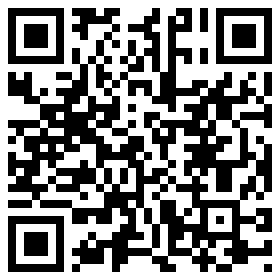

=============
Mobile client
=============

.. raw:: html

    

Using Seohtracker on your desktop is perfectly fine, but there might be times
where you are away from it. Maybe you want to take that trip you always wanted
to but don't want to bring the computer with you? Keeping track of measurements
on paper to later input them is a chore.

If you have an iOS device you can download `Seohtracker for iOS
<http://itunes.apple.com/es/app/seohtracker/id805779021?mt=8&ls=1>`_ and keep
track of your weight away from your desktop machine. Simply use the
`import/export feature <import_export.html>`_ to copy your database to the
mobile and later bring it back.

You can find `Seohtracker for iOS on the appstore
<http://itunes.apple.com/es/app/seohtracker/id805779021?mt=8&ls=1>`_ searching
for its name. Or if you have a `QR code
<https://en.wikipedia.org/wiki/Qr_code>`_ scanner, you can scan the following
QR code to install it.

.. raw:: html

    

.. raw:: html

    

